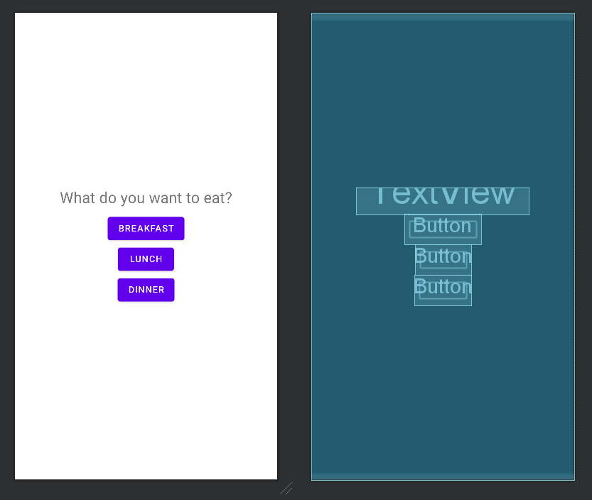
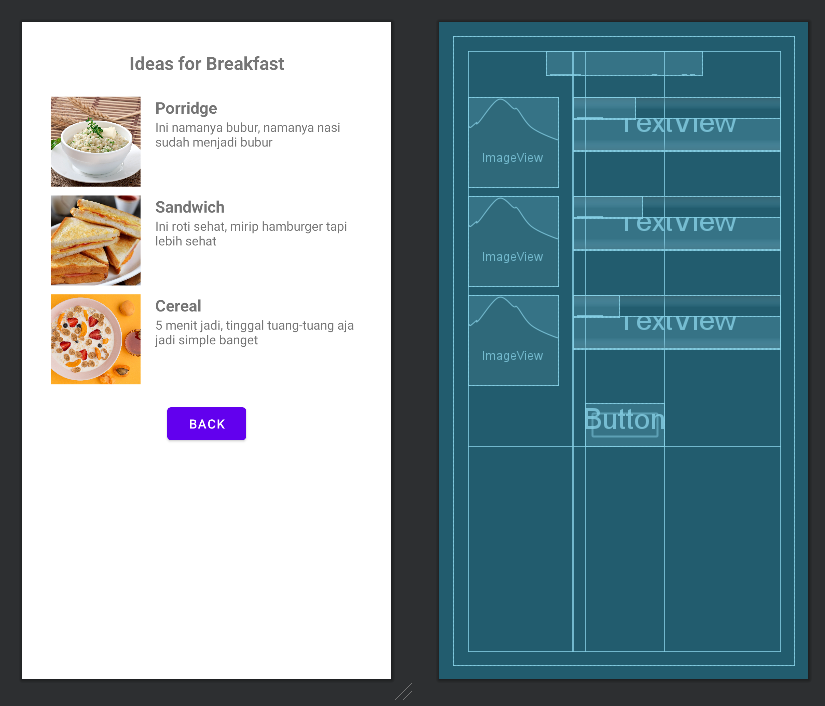
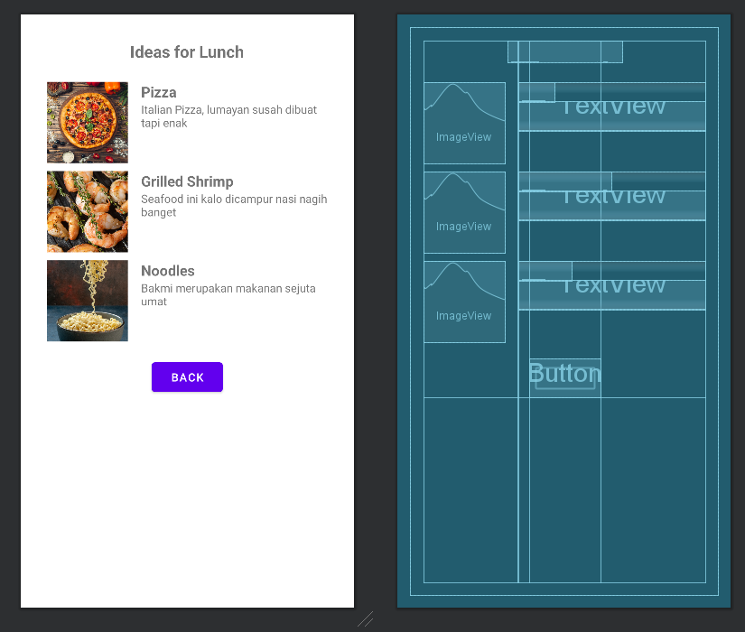
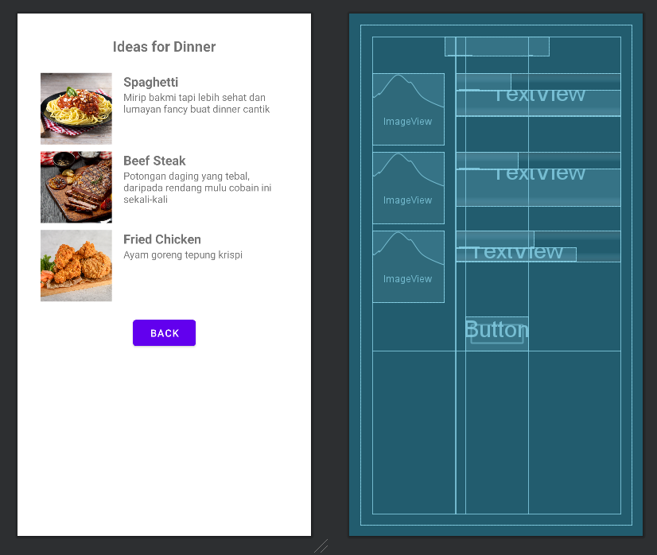

# recipe-prototype
GSLC Mobile Programming Session 4
Nelsen Gabriel - 2540096251

Saya telah membuat aplikasi prototipe untuk mencari resep berdasarkan waktu makan, yaitu breakfast, lunch, atau dinner. 

Activity_main (Linear Layout) :
- Menggunakan Linear Layout dengan orientasi vertikal.
- Terdapat judul atau title di bagian atas dan tombol-tombol untuk memilih waktu makan (breakfast, lunch, dinner).

Activity_recipe (Grid Layout dan Linear Layout) :
- Grid Layout digunakan untuk title (dengan penggabungan kolom) dan pengaturan list makanan.
- Pada bagian title, ada penggabungan kolom (columnSpan) di Grid Layout untuk judulnya
- Daftar makanan disusun dalam dua kolom: satu untuk gambar dan satu untuk teks (judul dan deskripsi).
- Teks (judul dan deskripsi) di dalam grid makanan diatur dalam Linear Layout yang mengikuti orientasi vertikal dalam kolom kedua.
- Pada bagian bawah, terdapat back button yang juga menggunakan Grid Layout dengan columnSpan.

